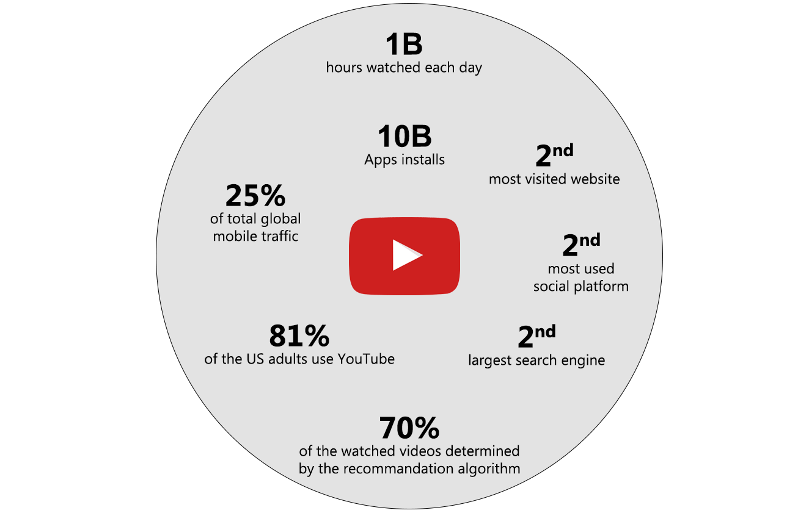
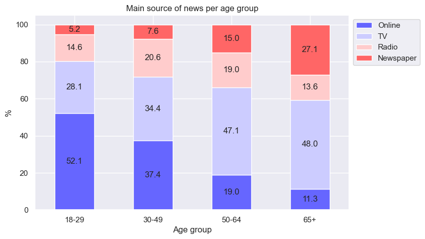
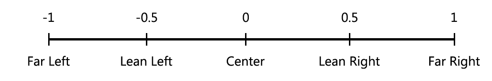
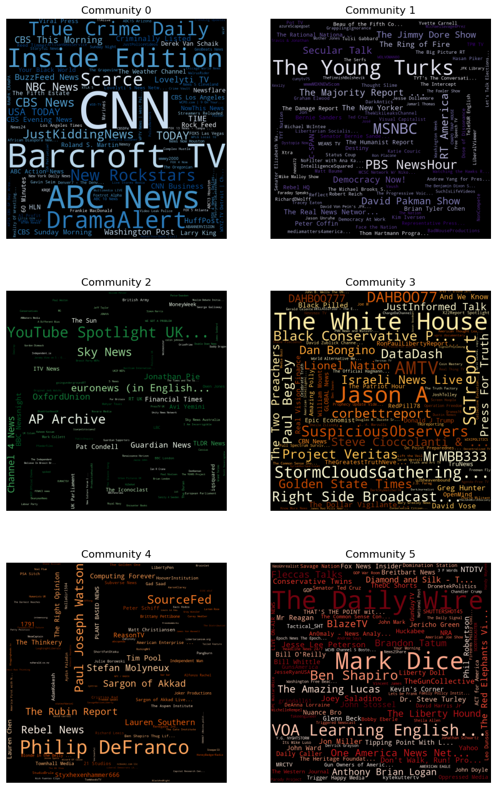
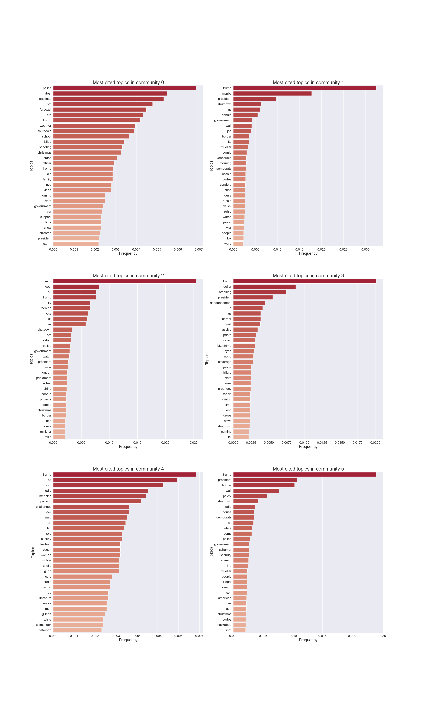

## Pro- or Anti- ?

In 2017, with the arrival in power of Donald Trump as president of the United States, the American political world quickly split between the pro and anti-Trump. This polarization began in the late 1990s and and has been only increasing since, promoted by the US voting system and the two-party system. Is this polarization is also reflected online ? Can the same effect be measured on YouTube communities ? In this data story, we will analyze the profiles of political communities on YouTube.

<!--- According to a [study][1] lead by Jesse M. Shapiro, Brown University,-->

## YouTube may be more ubiquitous than you think!

The YouTube that once was a simple video hosting platform has since become one of the main source of our information, entertainment and even social network. YouTube in 2022, this is 

The recommendation algorithm of YouTube is probably one of the most powerful and influencial in existence today, promoting content that works and that might enclose people in their own filter bubble, thus increasing polarization. And no one exept knows exactly how it works... 

With such a powerful striking power and influence, YouTube plays an increasing role on people's opinions, as it is used more and more to get news.

[//]: # (India leads as the country with the highest number of YouTube users at 467 million)
<!---  -->
<!--- *Complete disconnexion of political landscape. Pablo Ortellado and Marcio Moretto Ribeiro, CC BY* -->

The way of consuming the news has not stopped evolving over time. With the invention of the printing press, the world of information has been considerably changed. Then the news, transmitted more and more quickly with the development of the radio, the information has then changed its face to become more widespread and entertaining with the arrival of television in households. Finally, since the creation of the Internet, much information is transmitted through this channel. Today, about 40% of Americans get news Online. It is even the number one source of information for the 18-45 age group. With the development of social networks, more and more people are getting information online and this also raises more and more questions.

In the social media family, after Facebbok, YouTube is the second website where people get most of their news. In [2020](https://www.pewresearch.org/journalism/2021/01/12/news-use-across-social-media-platforms-in-2020/pj_2021-01-12_news-social-media_0-02/), almost one in four people (23%) regularly get news on YouTube.

## So, What is the Importance of News & Politics Channels on Youtube?

Let's investigate on the topic thanks to the [YouNiverse](https://github.com/epfl-dlab/YouNiverse) dataset that comprises metadata from over 136k YouTube channels and 72.9M videos (English-Speaking only!) published between May 2005 and October 2019, as well as channel-level time-series data with weekly subscriber and view counts. Furthermore, it contains about 8.6B comments made by ~449M users in 20.5M videos.

YouTube contains millions of videos, but you would maybe be surprise that the YouTube category with the most uploaded videos is the News & Politics one.
The category contains more than 18% of the videos contained in the dataset. However, when we are looking at the number of view or channels, the story changes drastically. The News & Politic channel represents less than 3% of the total number of channel and count for only 1.74% of the total number of views.


<iframe src="assets/img/news_pol_3pie_supperposed.html" height="600px" width="100%" style="border:none"></iframe>


## Where are we going?

Even if the number of views is incomparable with the most attractive categories such as entertainment and music, the News and Politics categories is pushing its way up. Over the last fwe year it can be observed that this is the category with the fastest growth.



Moreover, during the first fews months of 2019 it even manage to became the first category regarding the number of uploaded videos.



<iframe src="assets/img/news_pol_3pie_overview.html" height="600px" width="200%" style="border:none;" margin-left="-400px"></iframe>

## What is the problem then?
You may think. "Well, Great!, One other great platform to get great sources of information!". I hate to disappoint you but the reality may be more complex...

 

 

Answer the following questions:

*   Can we identify communities inside the main US News&Politics channels ? Is there a clear left-right polarization ?
*   What is the distribution of users polarization? Is it Gaussian? How many very extreme users do we see?
*   How are main political events treated by channels in different communities ?

## Are the users only commenting on channels of their political views?

Political polarization is, according to wikipedia, the divergence of political attitudes away from the center, towards ideological extremes. In a polarized society, people tend to get further and further away from the middle and from each other, rejecting any kind of middle ground and enclosing themselves in their filter bubble, only watching news that already matches their opinion. 

How could we quantify this on YouTube? Since we have a list of channels classified on a left-right axis, let's evaluate each user by the orientation of the channels on which he mostly commented on, and call it an "open-mindness score", "political engagment score" or polarization score, alias **p-score**. This rating would be the average of the "score" obtained by one user that gets points for each comment on classified channels, according to the following scale:

If Bob commented on 1 videos of channels classified as "far-right", 2 "lean left" channel and 1 "left" channel, his score will be 1-1-2*0.5 = -1 and his p-score will be -1/4 = -0.25. A ideal non-polarized society will show a high number of users with a score close to zero, and very low amount of users with a high score towards the extreme left (-1) or far right (+1). What is the shape of the distribution that is actually observed in the dataset?



In this figure are counted each person that is significantly involved in the US medias, with between 25 and 10'000 comments per year on the channels classified by AllSides. Unfortunately, distributions before 2015 were ignored due to a lack of data. This is due to the rapid growth of Youtube in the last years, as seen previously.

First of all, all years exhibit a bias towards the left, since the biggest and more mainstream channels are generally considered as lean left. However, there is a clear general trend with a shift of the median towards the left throughout the years.

Second observation, the extremes grow, and they grow fast! More surprisingly, it appears that there is a very high proportion of very high scores. Keep in mind that these are people with at least **25 comments** each year who are commenting **exclusively** on far left or far right channels. Nowhere else.

## Finding the communities

### trying out on subset dataset

### Running  on more data

To find communities amongst youtube channels, we created a graph using user comments. The graph was created as follows:
If Alice comments on Video 1 of channel A and on video 2 of channel B, we create an edge of weight 1 between channel A and B. 

For time purposes, we used only a subset of the comment for the graph generation (approx 17 hours of runing time for graph generation)

We then run the louvain algorithm to find some communities

### Dataset cleaning

Success ! We did get communities rapidly. But some communities do not seem to have their videos in english or have any interest in the politics of USA. By checking out the biggest channels of each community, we can quickly get an idea of which communities are of interest to us or not. We can discard the unnecessary ones.

Out of the 2262 initial channels we have 1095 channels left.

### Clean communities

We run the louvain algorithm again on our reduced but cleaner dataset and obtain 7 communities.

 - Community 0 has 341 members
 - Community 1 has 140 members
 - Community 2 has 104 members
 - Community 3 has 255 members
 - Community 4 has 98 members
 - Community 5 has 155 members
 - Community 6 has 2 members

Since community 6 has only 2 channels, we choose to ignore it in the future steps. 

## Identification of communities
## How to politically categorize communities

In order to give a political orientation to the communities, we decide to ask [allsides](www.allsides.com) for a little help. Allsides is a website that categorize media according to their political bias. They use different methods to class the a media in the five following categories : "Left, Lean Left, Center , Lean Right, Right".

Once this new argument added, the political orientation of the communities slowly show up.



Although the communities 2,3 and 4 does not seem to be heavily politically polarized, it is a different story for the communities 0, 1 and 5. When communities 0 and 1 are part of the left wing of the political spectrum the 5 is the great representative of the right wing.

## Going further than partisan categorization

At this point in our exploration of News & Politics channels, we observe that the classical partisan confrontation between right and left, Republicans and Democrats, is not sufficient to caracterize the polarization of political communities on YouTube. This approach, if it has been able to label two communities as left wing and one as right wing, leaves three communities with no clear identity.
YouTube as a news media gives more space for alternative thinking and allows a wider variety of speeches. In order to understand the identity of the remaining communities, we will now run an analysis of terms used in videos titles. Digging into the topics that these news channels discuss will lead us to better understand them.

To perform this analysis, we decided to focus on a two months period, from December 2018 to January 2019.

<b><i>What specific events happened during this period of time ?</i></b>

These two months were rich on the political scene, for U.S. national politics, as well as for U.S. international relations.

- US President Donald Trump and Chinese President Xi Jinping agreed on a trade war truce
- Dec 5 is National day of mourning for former US President George H. W. Bush, after his national funerals
- The risk of government shutdown is high, Trump said he would be "proud" to shut down the government
- The topic of border wall is brought back to the forefront by Donald Trump
- Nancy Pelosi is reelected Speaker of the House of Representatives
- Trump seems more and more implicated on campaign fraud and Russion dealings

Abroad, it was also a rich period :
- Negociations about Brexit were going on, and Theresa May's Brexit deal with the EU is rejected by UK parliament
- France is facing with Yellow vests protests
- Andres Manuel Lopez Obrador becomes President of Mexico
- A UN ceasefire is agreed in Yemeni civil war

We will use the words occurences to see how these political events were covered in different communities. To get a first idea, here are the twenty most cited topics for each of the six communities that were previously identified.

<iframe src="assets/img/20_most_cited_topics.png" height="1200px" width="450%" style="border:none;" margin-left="-400px"></iframe>

Trump is always cited very frequently. But further inspection of the words occurences will allow us to analyse more in depth specific words that tell us a lot about a community : topics such as 'shutdown' or 'brexit' show interest of a community for specific aspects of the political news panorama during this period.

# Comparison with other lexical fields

In order to properly analyse the word occurences, we can compare them with datasets containing news titles on specific topics. We used the following datasets for the comparison :
- Rishabh Misra's [news categories dataset](https://www.kaggle.com/datasets/rmisra/news-category-dataset), classifying news from the HuffPost in different categories. We will be using the "Black voices" and "Queer voices" categories.
- The [LOCO dataset](https://www.researchgate.net/publication/355578021_LOCO_The_88-million-word_language_of_conspiracy_corpus), characterizing the cospiracy language

Computing the distance between topics in these datasets and in our communities, we observe the following result.



Community 0 is clearly the closest to the black and queer voices datasets. This is no real surprise, as it has been classified as leaning left. Community 4 is also clearly the closest to conspiracist news. This clarifies the profile of this community, as we had no information so far. As the conspiracy is not present in medias described by AllSides, it makes sense that this community was not represented in the left/right classification performed earlier.

We would like to go further, and understand the last communities on which we still have no clue. To do so, we created words ensembles and tried to "trigger" a reaction from a community when analysing the occurences of these words ensemble. The words ensembles that were created are used to test lexical fields that have not been tested so far : international news, religion and beliefs, closeness to Donald Trump, U.S. domestic affairs.

<b><i>For which words ensemble do we see a specificity in occurences for communities 2 and 3 ?</i></b>

Here are the results for the words ensemble on international news, and on religion and beliefs





This clearly shows the orientation for our incognito communities.

Community 2 reacts to international news lexical fields. Brexit is its most cited topic, and this community shows large interest for Europe, foreign countries leaders and other continents. Affairs regarding China appear to be discussed in this community more than in others, even if it is also discussed in communities 1, 3 and 5 in lower proportion. Interestingly, when isolating 'Yemen', comunity 2 is only the second community citing this country, as it is more present in community 1, and this topic appears to be interesting for left wing also.

Community 3 clearly shows interest for religion and beliefs. It shows sharp peaks for topics such as 'ufo', 'prophecy' or 'christ'. It was not idenfied as close to conspiracist discourse, and therefore these channels don't appear to be widespreading conspiracy theories. They appear to be more focusing on religion and surnatural events.

We now have a clearer idea on the profile of all these six communities. Knowing these profiles, it can be interesting to see how these communities cover the news. In particular, we could ask ouselves how the main topics on American politics are present. We made a short selection of these topics, taking into account what happened specificaly during the studied period (Dec. 2018 - Jan. 2019)

## Limitations of the dataset and this study

* English-speaking only, US only and politics only (very very small window over of the entirety of Youtube)
* Dataset is not clean
* Only channels with >10k subscribers
* Only comments on relatively big videos ()>30 comments)
* Stops in 2019: rapid growth means that the trends were even more exacerbated in the last 3 years
* Our protocols are in place and the work could be generalized to a larger set with more time.

[1]: https://www.nber.org/papers/w2666
[2]: https://theconversation.com/mapping-brazils-political-polarization-online-96434
