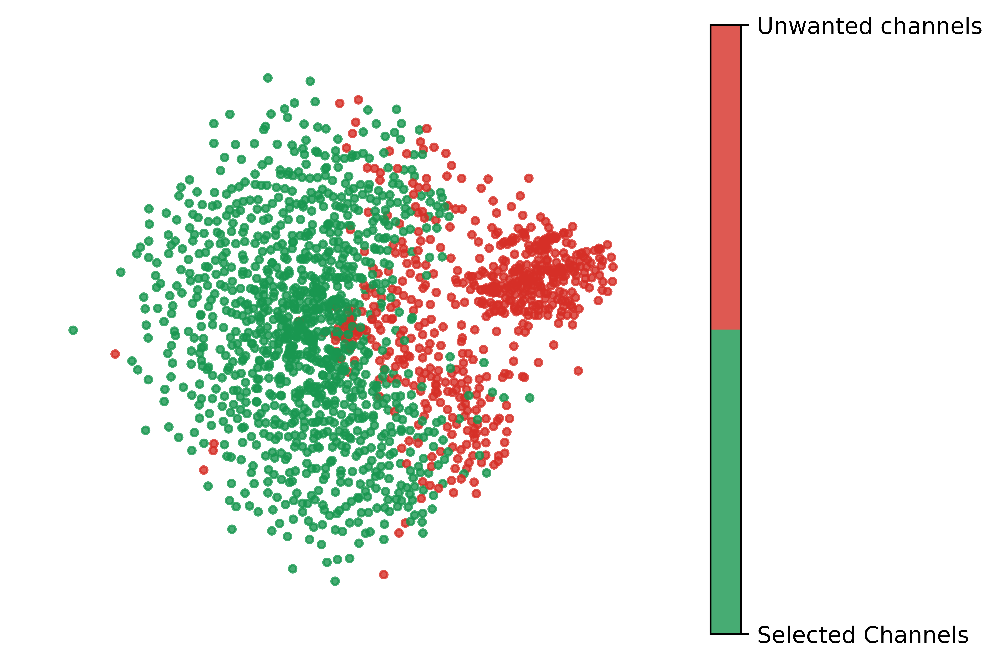

## Introduction

In 2017, with the arrival in power of Donald Trump as president of the United States, the American political world quickly split between the pro and anti-Trump. According to a [study][1] lead by Jesse M. Shapiro, Brown University, this polarization began in the late 1990s and early 2000s and has been only increasing since, promoted by the detrimental properties of the US voting system that incentivize people to become radical. This polarization is also reflected online: according to a [study][2] on Facebook lead by to Brazilian researcher, the polarization one year after the 2017 election can be pictured on the figure below. Can the same effect be measured on YouTube communities ? In this data story, we will analyze the profiles of political communities on YouTube.

## YouTube may be more ubiquitous than you think!

Donner des data sur YouTube:
- autant de vues sur YT que de recherches sur Google
- proportion de gens qui regardent YT
- YT is used more and more to get news (even more for young generations) and unlike traditional medias, information is much less controlled
- Algorithm that promotes content that works and that might enclose people in filter bubbles

<!---  -->

<!--- *Complete disconnexion of political landscape. Pablo Ortellado and Marcio Moretto Ribeiro, CC BY* -->

The way of consuming the news has not stopped evolving over time. With the invention of the printing press, the world of information has been considerably changed. Then the news, transmitted more and more quickly with the development of the radio, the information has then changed its face to become more widespread and entertaining with the arrival of television in households. Finally, since the creation of the Internet, much information is transmitted through this channel. Today, about 40% of Americans get news Online. It is even the number one source of information for the 18-45 age group. With the development of social networks, more and more people are getting information Online and this also raises more and more questions.

In the social media family, after Facebbok, YouTube is the second website where people get most of their news. In 2020, almost one in four people (23%) regularly get news on YouTube.

https://www.pewresearch.org/journalism/2021/01/12/news-use-across-social-media-platforms-in-2020/pj_2021-01-12_news-social-media_0-02/

## So, What is the Importance of News & Politics Channels on Youtube?

This study is based on the [YouNiverse](https://github.com/epfl-dlab/YouNiverse) dataset that comprises metadata from over 136k YouTube channels and 72.9M videos (English-Speaking only!) published between May 2005 and October 2019, as well as channel-level time-series data with weekly subscriber and view counts. Furthermore, it contains about 8.6B comments made by ~449M users in 20.5M videos.

YouTube contains millions of videos, but you would maybe be surprise that the YouTube category with the most uploaded videos is the News & Politics one.
The category contains more than 18% of the videos contained in the dataset. However, when we are looking at the number of view or channels, the story changes drastically. The News & Politic channel represents less than 3% of the total number of channel and count for only 1.74% of the total number of views.



<a src="_includes/figures/news_pol_3pie_overview.html" height="600px" width="100%"
>

<a src="assets/img/news_pol_3pie_overview.html" height="600px" width="100%"
>

<iframe src="_includes/figures/news_pol_3pie_overview.html" height="600px" width="100%" style="border:none"></iframe>



## Where are we going?

Even if the number of views is incomparable with the most attractive categories such as entertainment and music, the News and Politics categories is pushing its way up. Over the last fwe year it can be observed that this is the category with the fastest growth.



Moreover, during the first fews months of 2019 it even manage to became the first category regarding the number of uploaded videos.



<iframe src="assets/img/news_pol_3pie_overview.html" height="600px" width="200%" style="border:none;" margin-left="-400px"></iframe>

## What is the problem then?
You may think. "Well, Great!, One other great platform to get great sources of information!". I hate to disappoint you but the reality may be more complex...

 

 

Answer the following questions:

*   Can we identify communities inside the main US News&Politics channels ? Is there a clear left-right polarization ?
*   What is the distribution of users polarization? Is it Gaussian? How many very extreme users do we see?
*   How are main political events treated by channels in different communities ?

## Are the users only commenting on channels of their political views?

Quote/definition (wikipedia): 
Political polarization: divergence of political attitudes away from the center, towards ideological extremes. 

In a polarized society, people tend to get further and further away from the middle and from each other, rejecting any kind of middle ground and enclosing themselves in their filter bubble, only watching news that already matches their opinion. 

How could we quantify this on YouTube? Since we have a list of channels classified on a left-right axis, let's look at the entirety of their videos, and all users who commented on each one of them. 

Let's quantify this and call it an "open-mindness score", "political engagement score" or polarization score, alias p-score.

What is a p-score? The average of the "score" obtained by one user, for example Bob. If Bob commented on 1 videos of channels classified as "far-right", 2 "lean left" channel and 1 "left" channel, his score will be 1-1-2*0.5 = -1 and his p-score will be -1/4 = -0.25. A ideal non-polarized society will show a high number of users with a score close to zero, and very low amount of users with a high score towards the extreme left (-1) or far right (+1).

Data of the figure: people with between 25 and 10'000 comments per year (significantly involved).
Not enough data before 2015 for significant results. This is due to the growth of Youtube in the last years, as seen previously.



Throughout the years, there is a clear general trend towards the left (shift of the median), while the extremes grow.
Surprising: very high proportion of very high scores. These are people with at least 25 comments each year who are commenting *exclusively* on far left or far right channels.

Bias since the mainstream channels are more left

## Communities analysis

    

## Identification of communities
## How to politically categorize communities

In order to give a political orientation to the communities, we decide to ask [allsides](www.allsides.com) for a little help. Allsides is a website that categorize media according to their political bias. They use different methods to class the a media in the five following categories : "Left, Lean Left, Center , Lean Right, Right".

Once this new argument added, the political orientation of the communities slowly show up.



## Limitations of the dataset and this study

* English-speaking only, US only and politics only (very very small window over of the entirety of Youtube)
* Dataset is not clean
* Only channels with >10k subscribers
* Only comments on relatively big videos ()>30 comments)
* Stops in 2019: rapid growth means that the trends were even more exacerbated in the last 3 years
* Our protocols are in place and the work could be generalized to a larger set with more time.

[1]: https://www.nber.org/papers/w2666
[2]: https://theconversation.com/mapping-brazils-political-polarization-online-96434
